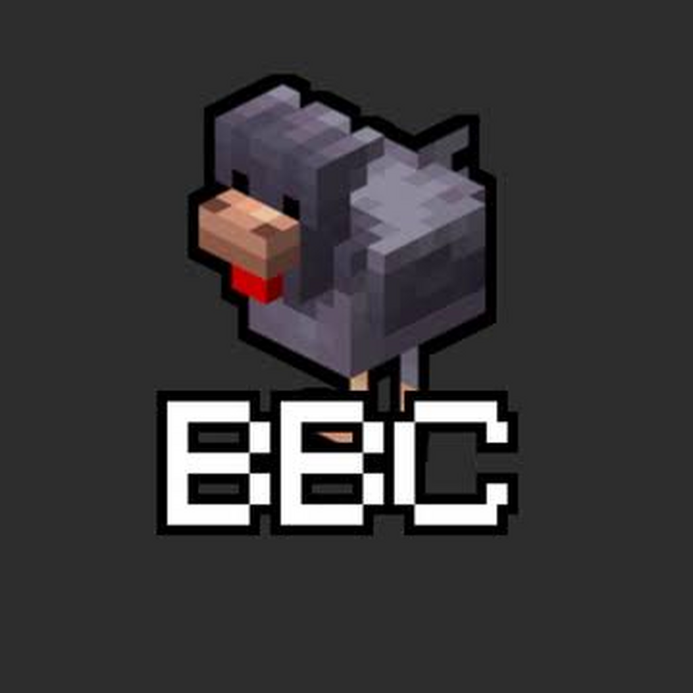

# BreakBlocks Launcher

<p align="center">
  
</p>

A Minecraft: Java Edition launcher for the BreakBlocks community. Manage your
accounts, instances and mods, and stay connected through the built-in
BreakBlocks chat. Available for Windows, Ubuntu and Steam Deck.

**Current version: 0.9.22 Alpha**

[Downloads](https://github.com/Zazuzin/BreakBlocks-Launcher/releases) ·
[Alpha test builds](https://github.com/Zazuzin/BreakBlocks-Launcher/actions/workflows/test-build.yml) ·
[Discord](https://breakblocks.com/discord) ·
[Report a problem](https://github.com/Zazuzin/BreakBlocks-Launcher/issues)

## Main features

- **Minecraft instances** — separate setups for Vanilla, Fabric, Forge,
  NeoForge and Quilt, with custom names, icons, RAM settings and playtime.
- **Microsoft sign-in** — use your Minecraft account, with Offline profiles
  available after ownership has been verified on the device.
- **Mod management** — browse Modrinth, install required dependencies, enable
  or disable mods, and check for compatible updates.
- **BreakBlocks Essentials** — optional installation of Meteor Client,
  Trouser Streak, Zazu's Server Seeker and Fabric API for Fabric instances.
- **Backups and restore** — automatic snapshots before mod changes and loader
  changes, plus manual backups. The five newest snapshots are kept per
  instance; restoring leaves your worlds untouched.
- **Duplicate, export and import** — copy a setup for testing or transfer it
  between computers. Include worlds and screenshots if you want them.
  Launcher account credentials and chat sessions are excluded.
- **Helpful launch errors** — explanations and next steps for common Java,
  dependency, memory and graphics failures, alongside the original report.
- **Built-in BreakBlocks chat** — persistent website sign-in, unread counts
  and notifications. On Windows, press **Ctrl+Shift+F9** for the chat overlay
  while playing in a window or borderless mode; **Esc** returns to Minecraft.
- **Launcher updates** — verified updates for Windows, Ubuntu and portable
  Linux, with separate Stable and Alpha channels.

## Installation

Download published packages from **Downloads** above. During Alpha testing,
open **Alpha test builds**, select a successful run and download its Windows
or Linux artifact from the bottom of the run page. GitHub requires sign-in to
download workflow artifacts, which are kept for 14 days.

You need a Microsoft account that owns Minecraft: Java Edition for normal
online play. Python is included in the portable packages; the launcher selects
or downloads the Java runtime needed by your chosen Minecraft version.

### Windows

1. Download the Windows x86_64 ZIP from this repository.
2. Extract the whole ZIP into a folder such as `BreakBlocks-Launcher`.
3. Open the extracted folder and run **BreakBlocks Launcher.exe**. Keep the
   executable and `_internal` folder together; do not run it inside the ZIP.
4. Add your Microsoft profile, create an instance and launch Minecraft.

#### Windows SmartScreen warning

The current Windows build is unsigned, so Windows may show **Windows protected
your PC** or **Unknown publisher** when you open it. This warning can occur
because the app has no established signing or download reputation.

For a build you downloaded from this official repository and trust, click
**More info**, then **Run anyway** to continue. You do not need to turn off
Windows Defender or SmartScreen. A managed computer may prevent this option.

See [Microsoft's SmartScreen overview](https://learn.microsoft.com/en-us/windows/security/operating-system-security/virus-and-threat-protection/microsoft-defender-smartscreen/)
for how these warnings work.

### Linux — Ubuntu

The `.deb` package targets **64-bit Ubuntu 24.04**.

1. Download the Ubuntu amd64 `.deb`. If you downloaded a Linux workflow
   artifact, extract its ZIP to find the `.deb` and Steam Deck archive.
2. Open a terminal in the folder containing the package and run:

   ```bash
   sudo apt install ./BreakBlocks-Launcher-0.9.22-Ubuntu-amd64.deb
   ```

3. Open **BreakBlocks Launcher** from your applications menu, or run
   `breakblocks-launcher` in a terminal.
4. Add your Microsoft profile and create an instance.

The package uses Ubuntu's system Python and Tk and installs its other
dependencies automatically. Launcher updates use the normal administrator
approval prompt to install the new package.

### Linux — Steam Deck / portable

1. Switch your Steam Deck to **Desktop Mode**.
2. Download and extract the Steam Deck x86_64 `.tar.gz` archive.
3. Open the extracted `BreakBlocks-Launcher` folder and run **BreakBlocks
   Launcher**. Choose **Execute** if prompted and keep the entire folder
   together.
4. To add it to Gaming Mode, open Steam and choose **Games → Add a Non-Steam
   Game to My Library**, then select the launcher executable.

No system package installation or changes to SteamOS's read-only partition are
required. The in-game chat overlay is currently available on Windows only.

## Backups and moving instances

Select an instance and open **Instance Tools** for **Backups / Restore**,
**Duplicate instance**, **Export instance**, or **Repair installation**.
Use **Import** above the instance list to load a BreakBlocks instance ZIP.

Recovery snapshots contain mods, configs, game options and the launch profile;
they are not world backups. Export or duplicate with **Include worlds and
screenshots** selected to copy those files too. A transferred instance gets a
new ID and downloads the launch files needed on the destination platform.

Close Minecraft before changing or transferring its instance. Import currently
supports ZIPs exported by BreakBlocks Launcher. Mods and their configuration
files retain their own licences and can contain personal settings.

## Tutorial

A video tutorial is planned. The link will be added here when it is ready.

## Troubleshooting and support

- **Minecraft fails to start:** read the explanation in the error window and
  open **View report** for details. Use **Repair installation** for damaged
  launch files, or restore the backup made before a mod or loader change.
- **Alpha updates do not appear:** select the **Alpha** update channel in
  Settings. Updates become available after a release has been published.
- **Windows chat overlay:** start Minecraft through this launcher and use
  windowed or borderless mode, then press **Ctrl+Shift+F9**.
- **Reporting a bug:** include your launcher version, operating system,
  Minecraft version, loader and steps to reproduce it in a
  [GitHub issue](https://github.com/Zazuzin/BreakBlocks-Launcher/issues), or
  ask in [Discord](https://breakblocks.com/discord). Remove personal information
  from logs before sharing; do not share `launcher.json` or account tokens.

Existing profiles, instances and chat sessions are preserved when updating.
Use **Settings → Open Launcher Folder** to find your local files.

## Credits

- [Zazuzin](https://github.com/Zazuzin)
- [Etianl](https://github.com/etianl)
- [BreakBlocks.com](https://breakblocks.com) and the BreakBlocks community
- [Mountains of Lava Inc.](https://www.youtube.com/@mountainsoflavainc.6913)
- The developers of Python, Tcl/Tk, CustomTkinter, Pillow, PySide6/Qt,
  Modrinth, the supported mod loaders and the optional mods.

See [Third-Party Notices](THIRD-PARTY-NOTICES.md) for dependency attributions
and licences. Community artwork belongs to its respective creators.

## Licensing

The launcher's original source code is licensed under the
**GNU General Public License v3.0 only** (`GPL-3.0-only`). See [LICENSE](LICENSE).

Third-party software retains its own licences. BreakBlocks branding, community
artwork and third-party trademarks are not covered by the source-code licence
unless their owners explicitly say otherwise. Minecraft, Java, loaders and
downloaded mods remain subject to their respective licences and terms.

## Disclaimer

**NOT AN OFFICIAL MINECRAFT PRODUCT. NOT APPROVED BY OR ASSOCIATED WITH MOJANG
OR MICROSOFT.**

BreakBlocks Launcher is an independent community project. Minecraft is a
trademark of Microsoft Corporation; Minecraft and related assets belong to
Mojang AB and their respective rights holders. Use of third-party names does
not imply endorsement.

See the [Privacy Notice](PRIVACY.md), [Terms](TERMS.md),
[Minecraft EULA](https://www.minecraft.net/eula) and
[Minecraft Usage Guidelines](https://www.minecraft.net/usage-guidelines).

## Building from source

Developers can follow [README-SOURCE.txt](README-SOURCE.txt),
[BUILD-WINDOWS.md](BUILD-WINDOWS.md) or [BUILD-LINUX.md](BUILD-LINUX.md).
Changes are recorded in [CHANGELOG.md](CHANGELOG.md).
